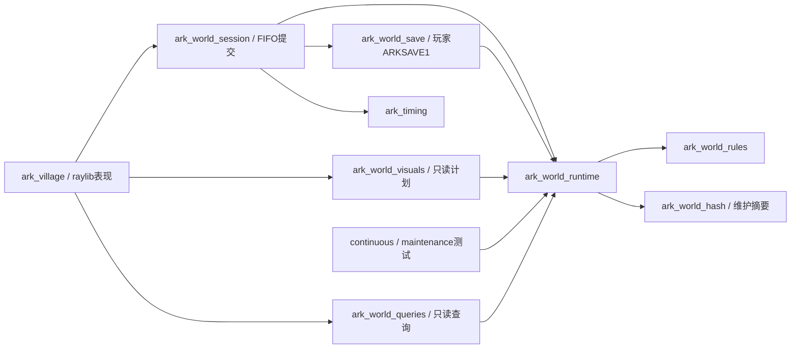

# 产品可维护性审阅

2026-10-07。

## 范围与判断

代码审阅基线为产品e7f441f、冻结524415a的354项；研究核对至aa38825（含c52b5a2）。aa38825仅补原档引用、表现队列与日历恢复的静态合同，未改维护实现；不改变本轮工程结论。研究历史与接入候选见[当前对照](reference/REFERENCE_CHECKLIST.md#research-history-current-audit)。审阅CMake/公开头/默认会话与存档/desktop输入绘制/导入及字段工具/测试注册/模块README；不重新逆向，不逐分支证明全部算法，也不用历史验收代替本次检查。

现架构可以继续发展：simulation没有向app/desktop/raylib的include；唯一Owner、私有候选、不可变快照、PImpl工作线程、停止join、generation拒旧命令及声音一次领取均有实现和解释原因的注释。平台最终绘制与无raylib的显示计划分开；旧ark_game为显式诊断，没有同时运行两套持久世界的证据。

本轮未发现P1。下述P2是确认的失效路径或明确维护风险，P3为接口/工程防错；不只凭文件大小判问题。冻结inc/json体量服务协议覆盖，现有按职责UI文件和同依赖测试runner应保留。

默认主链依赖摘录（箭头指向依赖，省略启动/元数据/legacy旁路）：

AVRSAVE当前内置runtime，所以玩家也加载hash；依赖见[ProductLibraries](../cmake/ProductLibraries.cmake#L13)及[WorldSimulation](../cmake/WorldSimulation.cmake#L57)。ark_game仍被同一EXE的legacy分支/共享资源适配引用，但未进入默认规则链，图中未展开。

## P2-01：独立simulation入口已失效

位置：[独立CMake](../tests/simulation/CMakeLists.txt#L4)、[WorldSimulation](../cmake/WorldSimulation.cmake#L7)。审阅前README承诺独立标准C++排查；入口只include模块，缺根工程ark_windows_manifest/ark_use_shared_runtime与公共库初始化。默认未创建runtime，便开始测试注册。

已用现有x64 Clang/Ninja实际配置，退出1：Unknown CMake command ark_windows_manifest，调用点WorldSimulation:88。日志：build/validation/product-review-20261007/standalone-probe.log。这不影响受支持的根headless预设。

建议撤下过期入口或明确转向根headless-*预设，集中维护一套初始化。此轮仅修正README承诺，构建实现未改。验收：根headless配置/构建、原测试注册/参数/断言不变。

## P2-02：普通试玩持续保留全部绘制统计

位置：[world_view](../src/desktop/world_view.cpp#L569)、578、1049、1097。默认frames=0无限运行，但每帧向frame_intervals/render_costs追加；退出percentile还按值复制并排序。60FPS两列double仅有效样本约3.3MiB/小时，另有vector容量及退出临时复制；这是仪表开销，和原世界历史增长不同。

建议有界--frames诊断保留统计合同，普通试玩关闭逐帧采样或使用有界/在线统计。保持FPS、47ms、逻辑轮次与世界历史。验收用采样开关/边界和既有有界窗口统计，不为此重跑完整自然前缀。

## P2-03：维护存取与核心runtime目标混装

位置：[WorldSimulation](../cmake/WorldSimulation.cmake#L42)、[源清单](../cmake/WorldSimulationSources.cmake#L93)、[file_io](../src/simulation/startup_world_file_io.cpp#L6)。AVRSAVE1仅用于维护/测试，却把四实现、生成identity及hash依赖编进玩家必用的ark_world_runtime，默认玩家因此加载维护hash并携带平台文件替换代码。其余runtime消费者没有调用维护接口，分离不需要新Owner。

建议独立ark_world_persistence目标，依赖唯一runtime/hash；continuous与维护套件显式链接它，玩家ARKSAVE1保留原target。源位置/字节、canonical身份与字段算法不变。当前递归收包正确，这不是漏DLL故障。

验收：两套Debug标准、新四项回归和相关认证尾段；Release PE依赖确认玩家不再携带维护hash，维护工具仍完整链接。不得复制runtime、改协议或删除断言。

## P2-04：桌面协调器变更面集中

位置：[world_view](../src/desktop/world_view.cpp#L154)、264、529、643、731、834、942、1053。1150行只是线索；实际问题是同文件负责自然预运行/截图夹具、存档窗口验收、窗口/字体初始化、FIFO回执、菜单/任务/文字输入、绘制和统计。新增页可能同时改输入分派、绘制分派、字形清单及检查入口，扩大热区/优先级回归面。

建议先抽出inspection/capture和统计，再按平台输入采样、页面控制/回执、frame绘制拆实际职责；run_world_game作薄协调。复用WorldManagement/ui，不预建事件总线。保持generation清理、pending打开屏障、held释放、只读绘制、插值资格及自然截图前缀。

验收归既有world_menu/world_tasks/world_building/world_session，补少量输入竞争/焦点丢失与相关窗口，不复制领域组合或全长链。

## P2-05：玩家存档缺新增字段分类防漏

位置：[world_save_fields](../src/app/world_save_fields.hpp#L189)、[恢复](../src/app/world_save_restore.cpp#L728)、[维护coverage](../scripts/simulation/generate_owner_codec.mjs#L106)。ARKSAVE1手写耐久字段与清理/恢复逻辑；维护AVRSAVE完整AST检查不证明玩家子集覆盖。新研究字段即使通过维护codec/来源检查，仍可能忘记判断玩家档应保存、沿用、重建或丢弃。

这是演进风险，未认定本批已有字段丢失。建议独立玩家分类清单并登记理由，复用AST枚举检测未分类新增字段；normal/replay与玩家期望分开，保留随机不落盘和schema2政策。不要为去重直接替换玩家codec。

验收：未分类新增字段明确失败；原字节/拒绝/随机/暂停/回滚不变，恢复不收费或发奖。避免复制反射工具或用被测编码器生成期望。

## P2-06：现状与历史文档矛盾

审阅时REFERENCE_CHECKLIST的UI03仍只开两项，UI06/C05仍拒绝混合道路，UI10/UI15/UI16/UI17/C22/C26仍把道具/扩张/文件存取写成未接；[app README](../src/app/README.md)还写村办禁用。people/facilities模块未明确legacy，容易把修正写进旧实现。B1约1517行/213KiB，规模本身不是bug，但多处重复当前/最新事实使漂移明显。

此轮已按实际源码修正现状条目和相关模块/独立入口说明，历史ADR/验收保留。建议reference负责当前研究/产品差距，TODO只列当前动作，B1负责带版本的历史证据；模块README只说明职责/入口并链接现状。不为每次修复再建文档，也不删除有用历史。文档更正仅检查差异/链接，交付时分别记录研究、产品与原版动态结论。

## P3-01：公开archive头声明未提供的功能

位置：[archive.hpp](../include/ark/assets/archive.hpp#L33)、[sha256.cpp](../src/assets/sha256.cpp#L4)。只导入SHA实现，却公开read_binary_file/CRC/解密/提取等声明；误用会链接失败并误认产品可提取原资源。当前存取仅调用已有摘要，没有发现现有调用失败。

建议窄sha256公共接口，完整archive头按冻结需要留内部；include映射登记机械适配/product_patch，不改研究或hash凑通过。assets README区分元数据/维护摘要。验收保持SHA/协议/回放一致，公开接口与实现配套。

## P3-02：命令payload和页族契约分散

位置：[WorldCommand](../include/ark/app/world_session.hpp#L104)、[is_decision_page](../src/app/world_commands.cpp#L138)、[world_human_page](../src/desktop/ui/world_human.cpp#L74)、[WorldManagement](../src/desktop/world_management.cpp#L59)。不同动作共用selection/definition/actor/facility/page字段；页族分别出现在通用ack守卫、UI输入/绘制和检查器。当前有源校验/回滚，重复不代表这些策略应完全合并；新页容易遗漏路由，selection语义不能只靠调用位置。

先注明每类selection是列表索引/定义ID/实例ID，保留页身份绑定；随实际新功能引入小范围typed factory/payload。只共享确实同义的非退休页查询/页族名，区分UI可见性、ack资格、模态更新；raw数值保留来源。测试关注新页输入/绘制/迟到拒绝，不逐case复制规则。

## P3-03：字体打包和运行图集是两份清单

位置：[prepare_windows_font](../scripts/prepare_windows_font.py#L41)、[glyphs](../src/desktop/world_view.cpp#L87)、[Text](../src/desktop/resources.cpp#L310)。打包扫描源码/数据，运行时另维护手工label串和目录文本。新字可能进入字体文件却未请求进图集；prepare只验证已请求字形，漏请求不一定报错。本轮未证明当前某页已缺字。

建议生成可追踪的运行字形需求给打包和Text共用，保留目录/脚本/ASCII；以一个新增真实页面字形验证端到端需求，不用全字体或生成图片掩盖。

## P3-04：公共DLL新旧防错只到工具链/架构

位置：[CommonLibraries](../cmake/CommonLibraries.cmake#L10)、[导出记录](../cmake/ProductLibraries.cmake#L110)。consumer构建不自动重建公共库；检查compiler/architecture/存在性，不检查当前头/实现与DLL指纹。文档要求先重建shared-libraries，受支持流程正确，本轮未发现ABI失配。

可后续加构建指纹或统一开发入口，让仅重建consumer却混旧库时明确拒绝。接口/实现/数据指纹用途分别说明；文档提交不同不机械使合法回放失效。四套消费者继续共用一套Release库。

## 注释、分文件与测试保留原则

线程/事务/随机/父页恢复注释解释原因，玩家字段旁也说明random/UI/账本历史刻意排除。需要补公共selection身份、诊断/生产边界、legacy定位和未实现API说明；无需给每个简单函数补注释。冻结raw字段保留来源名，以接口/合同链接解释，不因改名损坏审计/codec。

src/simulation约119文件中117项是冻结来源（含inc/json），通过维护交付/明确适配演进；desktop约96文件已有按职责UI模块，集中问题按责任拆。大测试不因此拆成大量EXE，同夹具/依赖共享runner，线程/长跑/来源检查独立。旧Game与当前runtime同名测试不是重复保障。DLL分组不求越细越好，优先真实依赖边界，不给每个页造DLL。

## 建议批次

| 批次（建议，尚未编码） | 具体范围 | 验收重点 |
| --- | --- | --- |
| A：小型工程收口 | 失效独立入口、普通试玩统计、窄SHA接口、明确公共构建入口 | 不改规则；CMake/核心边界执行两套Debug标准（排除三个月），接口/有界诊断定向检查 |
| B：依赖与协调器 | 独立维护persistence目标、分离inspection/正常协调、玩家字段分类防漏 | 唯一Owner/FIFO/generation/held；新四项回归与相关认证尾段，实际PE依赖和输入/窗口检查 |
| C：可见产品进展 | 先74静态子集、再75布局子集；不同文件职责可与工程批并行 | 既有UI套件/只读对照/窄窗口和一次Release窗口；完整奖励行/图标/演出继续等合同 |
| D：新消费时点 | 探索底栏Owner/随机/恢复设计；精确交付后补其他特效/经营入口 | 先确认设计，共同随机/顺序/回滚及相关尾段，不由FPS推进或重复奖励 |

不将A/B/C打成一次大重构。每批具体来源/范围/验收确认后编码；已确认玩家档/一倍速/本地验证政策沿用。本次只有审阅与文档整理。

## 本次检查与证据

Git/来源与include/调用静态审计、文档链接/差异检查；仅为P2-01做一次产品独立CMake配置并保留失败日志。未运行research构建、原游戏或本轮游戏CTest/窗口；a391d05的316项和双尾段是上一批证据，不作本次实现验收。此轮没有实现改动，不触发游戏回归。研究在途内容/原文件未改，账号/原档未复制。
